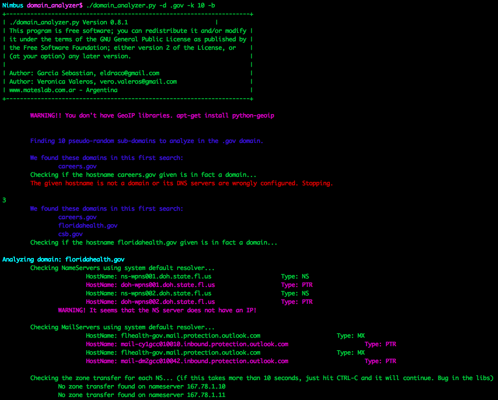

# Domain Analyzer

## What
Domain analyzer is a security analysis tool which automatically discovers and reports information about the given domain. Its main purpose is to analyze domains in an unattended way.

## Example default options

## How
Domain analyzer takes a domain name and finds information about it, such as DNS servers, mail servers, IP addresses, mails on Google, SPF information, etc. After all the information is stored and organized it scans the ports of every IP found using nmap and perform several other security checks. After the ports are found, it uses the tool crawler.py from @verovaleros, to spider the complete web page of all the web ports found. This tool has the option to download files and find open folders.

Current version is 0.8 and the main features are:

- It creates a directory with all the information, including nmap output files.
- It uses colors to remark important information on the console. 
- It detects some security problems like host name problems, unusual port numbers and zone transfers.
- It is heavily tested and it is very robust against DNS configuration problems.
- It uses nmap for active host detection, port scanning and version information (including nmap scripts).
- It searches for SPF records information to find new hostnames or IP addresses.
- It searches for reverse DNS names and compare them to the hostname.
- It prints out the country of every IP address.
- It creates a PDF file with results.
- It automatically detects and analyze sub-domains!
- It searches for domains emails.
- It checks the 192 most common hostnames in the DNS servers.
- It checks for Zone Transfer on every DNS server.
- It finds the reverse names of the /24 network range of every IP address.
- It finds active host using nmap complete set of techniques.
- It scan ports using nmap (remember that for the SYN scan you need to need root).
- It searches for host and port information using nmap.
- It automatically detects web servers used.
- It crawls every web server page using our crawler.py tool. See the description below.
- It filters out hostnames based on their name.
- It pseudo-randomly searches N domains in Google and automatically analyze them!
- Uses CTRL-C to stop current __analysis__ stage and continue working.
- It can read an external file with domain names and try to find them on the domain.

## Bonus features

@verovaleros developed a separate python web crawler called "crawler.py". Its main features are:

- Crawl http and https web sites.
- Crawl http and https web sites not using common ports.
- Uses regular expressions to find 'href' and 'src' html tag. Also content links.
- Identifies relative links.
- Identifies domain related emails.
- Identifies directory indexing.
- Detects references to URLs like 'file:', 'feed=', 'mailto:', 'javascript:' and others.
- Uses CTRL-C to stop current crawler stages and continue working.
- Identifies file extensions (zip, swf, sql, rar, etc.)
- Download files to a directory:
  - Download every important file (images, documents, compressed files).
  - Or download specified files types.
  - Or download a predefined set of files (like 'document' files: .doc, .xls, .pdf, .odt, .gnumeric, etc.).
- Maximum amount of links to crawl. A default value of 5000 URLs is set.
- Follows redirections using HTML and JavaScript Location tag and HTTP response codes.

## This extended edition has more features!
- World-domination: You can automatically analyze the whole world! (if you have time)
- __Robin-hood__: Although it is still in development, it will let you send automatically an email to the mails found during scan with the analysis information.
- Robtex DNS: With this incredible function, every time you found a DNS servers with Zone Transfer, it will retrieve from the Robtex site other domains using that DNS server! 
             It will automatically analyze them too! This can be a never ending test! Every vulnerable DNS server can be used by hundreds of domains, which in turn can be
             using other vulnerable DNS servers. BEWARE! Domains retrieved can be unrelated to the first one.

## Examples

- Find 10 random domains in the .gov domain and analyze them fully (including web crawling). If it finds some Zone Transfer, retrieve more domains using them from Robtex!!

    > domain_analyzer.py -d .gov -k 10 -b

- (Very Quick and dirty)  Find everything related with .edu.cn domain, store everything in directories. Do not search for active host, do not nmap scan them, do not reverse-dns the netblock, do not search for emails. 

    > domain_analyzer.py -d edu.cn -b -o -g -a -n

- Analyze the 386.edu.ru domain fully

    > domain_analyzer.py -d 386.edu.ru -b -o 

- (Pen tester mode). Analyze a domain fully. Do not find other domains. Print everything in a pdf file. Store everything on disk. When finished open Zenmap and show me the topology every host found at the same time!

    > domain_analyzer.py -d amigos.net -o -e

- (Quick with web crawl only). Ignore everything with 'google' on it.

    > domain_analyzer.py -d mil.cn -b -o -g -a -n -v google -x '-O --reason --webxml --traceroute -sS -sV -sC -PN -n -v -p 80,4443'

- (Everything) Crawl up to 100 URLs of this site including subdomains. Store output into a file and download every INTERESTING file found to disk.

    > crawler.py -u www.386.edu.ru -w -s -m 100 -f

- (Quick and dirty) Crawl the site very quick. Do not download files. Store the output to a file.

    > crawler.py -u www.386.edu.ru -w -m 20 

- (If you want to analyze metadata later with lafoca). Verbose prints which extensions are being downloaded. Download only the set of archives corresponding to Documents (.doc, .docx, .ppt, .xls, .odt. etc.)

    > crawler.py -u ieeeexplore.ieee.org/otherfiles/ -d -v 

Most of these features can be deactivated.

## Screenshots

1. Example domain_analyzer.py -d .gov -k 10 -b

# History
Domain analyzer was born on Feb 4th, 2011. You can check the original repository in source forge [here](https://sourceforge.net/projects/domainanalyzer/)

## Changelog

- 0.8
	We can check for hostnames read from an external file. Thanks to Gustavo Sorondo for the code! (iampuky@gmail.com)

## Installation
Just untar the .tar.gz file and copy the python files to the /usr/bin/ directory. Domain_analyzer needs to be run as root. The crawler can be run as a non-privileged user.
If you want all the features (web crawler, pdf and colors), which is nice, also copy these files to /usr/bin or /usr/local/bin

- ansistrm.py
- crawler.py
- pyText2pdf.py

If you have any issues with the GeoIP database, please download it from its original source [here](http://geolite.maxmind.com/download/geoip/database/GeoLiteCountry/GeoIP.dat.gz). And install it in where your system needs it, usually at /opt/local/share/GeoIP/GeoIP.dat

# Requests
If you have any question, please send us an email! They are in the python files.
